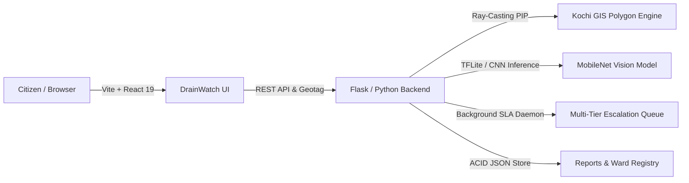

# 🌊 Kochi DrainWatch (LSGD JalaNidhi AI)
### Intelligent Municipal Canal & Storm-Drain Redressal Grid
**Challenge SC-08 — Selection Round Prototype | ANAVANDI 2026 Hackathon**  
*Organized by Jain (Deemed-to-be University) Kochi — School of Future*

[](https://drain-watch-final.vercel.app)
[](https://drainwatch-final.onrender.com)
[](https://drain-watch-final.vercel.app)

---

## 📌 Problem Statement (SC-08)
> **Problem:** Blocked drains may go unreported because residents do not know which authority or ward should respond.  
> **Build:** Create a photo-and-location reporting tool that identifies the correct local-body ward, creates a ticket, shows public status and escalates unresolved reports.  
> **A complete submission must show:** Report, ward identification, ticket, status, escalation, and an open-report map working end-to-end.

---

## 🌟 What Makes DrainWatch Unique? (Innovation & Key Differentiators)

1. **Dual-Model Edge AI Vision Pipeline (MobileNet CNN + TFLite Flatbuffer):**
   - Unlike generic forms, DrainWatch embeds a fine-tuned MobileNet deep learning model (`model.tflite` & `model.h5`) capable of distinguishing **Clean Unobstructed Water** from **Severely Choked / Polluted Water** with real-time confidence metrics.
   - Optimized flatbuffer footprint (~2MB) enables sub-100ms inference without cloud memory spikes.

2. **Sub-Millisecond Ray-Casting GIS Polygon Engine:**
   - No external paid geocoding APIs needed. DrainWatch uses an embedded **Ray-Casting Point-in-Polygon (PIP)** engine mapping latitude/longitude coordinates directly to Kochi Municipal Corporation's administrative boundaries.
   - Automatically attributes the exact **Ward Number**, **Ward Name**, **Ward Councillor**, **Assistant Engineer (LSGD Engineering Wing)**, and **Junior Health Inspector**.

3. **Statutory SLA & Automated Multi-Tier Escalation Matrix:**
   - Enforces time-bound governance under the Kerala Right to Services Act.
   - Background SLA monitoring engine tracks tickets and triggers automatic escalation levels (Supervisor ➔ Assistant Engineer ➔ Municipal Secretary ➔ District Disaster Management Authority).

4. **Public Verification & Evidence Transparency:**
   - Features a **Before vs. After photographic evidence audit trail** when municipal desilting operations conclude.
   - Public status timeline where every action is logged with timestamp, actor credentials, and verified remarks.

5. **Civic Gamification & Water Wardens:**
   - Citizens earn Civic Impact Points for validated reports, fostering community stewardship across Kochi's major canal corridors (Thevara-Perandoor, Edappally, Mullassery, Chilavannoor, Calvathy).

---

## 🚀 Key Features Overview

| Feature Area | Description |
|---|---|
| **📸 Smart Photo Grievance** | Capture or upload photographic evidence with automatic EXIF-aware image processing and preview. |
| **🤖 Dual Computer Vision** | Edge-accelerated AI analyzes canal blockages, classifies debris type (Plastic/Solid Waste, Hyacinth, Silt), and auto-suggests ticket priority. |
| **📍 Instant Geotagging** | High-precision GPS locator + interactive Leaflet GIS pin selector with presets for high-risk flood basins. |
| **🗺️ Open-Report GIS Map** | Live interactive OpenStreetMap showcasing polygon ward boundaries and real-time color-coded pins (Red: Escalated, Amber: Pending, Blue: In Progress, Green: Resolved). |
| **📋 Statutory Ticketing** | Generates official tracking codes (`KL-KCH-W{ward}-{year}-{seq}`) with transparent SLA resolution deadlines. |
| **⏳ Multi-Tier Escalation** | Automated daemon escalates delayed tickets through 4 municipal administrative echelons, plus citizen appeal overrides. |
| **👷 Officer Triage Console** | Administrative command portal for municipal engineers to assign field crews, adjust priorities, and upload resolution proof photos. |
| **🏆 Civic Champions Hub** | Leaderboard celebrating active community stewards and water wardens. |
| **📊 Public Analytics & SLA Dashboard** | Transparent statistics on municipal resolution hours, flood risk assessments, and ward-level blockage distribution. |

---

## 🛠️ Architecture & Tech Stack



- **Frontend:** React 19, TypeScript, Vite, Tailwind CSS v4, Lucide Icons, Leaflet.js
- **Backend:** Python 3.10, Flask, Flask-CORS, Gunicorn
- **Machine Learning:** TensorFlow Lite, MobileNet Transfer Learning, NumPy, Pillow
- **Spatial / GIS:** Ray-Casting Point-in-Polygon Engine (EPSG:4326 GeoJSON)
- **Deployment:** Vercel (Frontend Client), Render (Python Cloud Service)

---

## ⚡ Quick Start (Running Locally)

### Prerequisites
- Python 3.10+
- Node.js 18+ & npm

### 1. Clone Repository
```bash
git clone https://github.com/melizabyiju/DrainWatch_Final.git
cd DrainWatch_Final
```

### 2. Backend Setup
```bash
cd backend
python -m venv venv
# On Windows:
.\venv\Scripts\activate
# On Linux/macOS:
source venv/bin/activate

pip install -r requirements.txt
python server.py
```
*Backend server will start at `http://localhost:8088`.*

### 3. Frontend Setup
```bash
cd ../frontend
npm install
npm run dev
```
*Frontend will launch at `http://localhost:5173`.*

---

## 🧪 Automated Testing
Run the backend unit test suite validating GIS Point-in-Polygon resolution, SLA rules, and API endpoints:
```bash
cd backend
python -m unittest test_server.py
```
*Expected: 7 tests passing in < 0.1s.*

---

## 👥 Hackathon Team & Credits
- **Challenge:** SC-08 Canal & Storm-Drain Blockage Reporting
- **Event:** ANAVANDI 2026 — Jain (Deemed-to-be University) Kochi
- **Repository:** [melizabyiju/DrainWatch_Final](https://github.com/melizabyiju/DrainWatch_Final)
